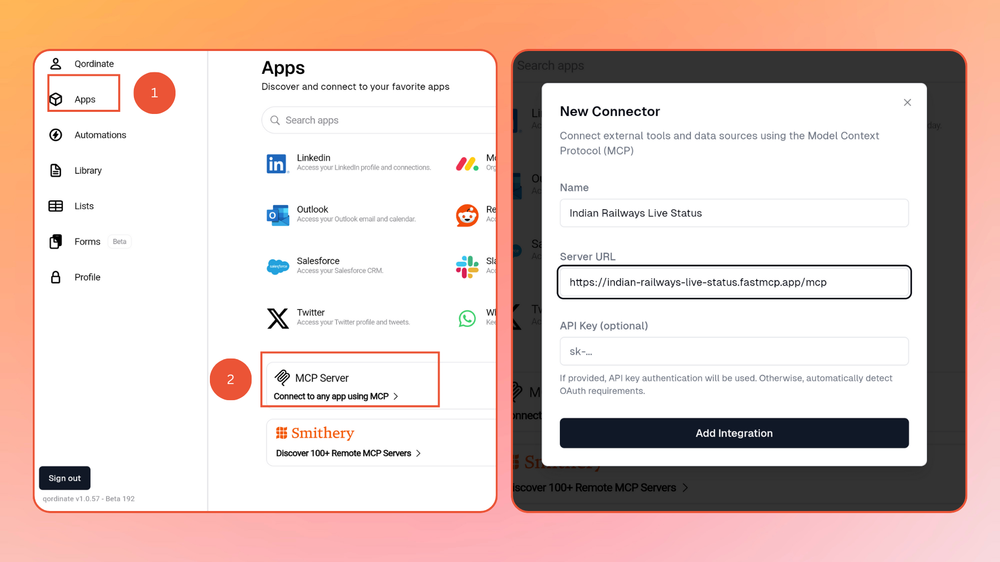

# Indian Railway Live Info MCP Server

A **read-only** Model Context Protocol (MCP) server that provides real-time Indian Railways information including PNR status, live train tracking, and station/train search capabilities.

> ⚠️ **Read-Only Server**: This MCP server only retrieves information. It does not perform any write operations, bookings, or modifications to any railway systems.

---

## Features

- 🎫 **PNR Status Tracking** - Check ticket confirmation status, coach/berth details, waitlist positions, and complete journey information
- 🚂 **Live Train Status** - Real-time train location, delays, expected arrivals/departures, and route information
- 🔍 **Station & Train Search** - Look up station codes and train numbers by name
- 📅 **Date & Time Utilities** - Get current IST time and calculate date differences
- 🔗 **PNR + Train Integration** - Automatically track trains using PNR with correct journey dates

---

## Connect Your AI App

### MCP Server URL
```
https://indian-railways-live-status.fastmcp.app/mcp
```

---

### 1. Qordinate

1. **Sign up / Login** to [app.qordinate.ai](https://app.qordinate.ai)
2. Go to **Apps** in the side panel
3. Scroll down and click **"Connect any App using MCP"** button
4. In the modal:
   - **Name**: Enter any name (e.g., "Indian Railways")
   - **MCP Server URL**: `https://indian-railways-live-status.fastmcp.app/mcp`
   - **API Key**: Leave empty
5. Now you can start using it in **Chat** or via **WhatsApp**!




---

### 2. ChatGPT

1. Go to **Settings**
2. Navigate to **Apps** section → **Advanced Settings** → **Create App**
3. Paste the MCP Server URL: `https://indian-railways-live-status.fastmcp.app/mcp`
4. To use: Enable **Dev Mode** in chat, click the **"+"** button, and select the tool


---

## What You Can Do

### 🎫 PNR Status
- Check if your ticket is confirmed or waitlisted
- Get your coach number and seat/berth details
- View complete passenger list with booking status
- See journey details: stations, date, time, class, fare

### 🚂 Live Train Tracking
- Track real-time location of any train
- Check current delay and expected arrival times
- See which station the train just crossed or stopped at
- View upcoming stations with estimated times
- Get the complete route of any train

### 🔍 Search
- Find station codes by name
- Search train numbers by train name

### 🔗 Smart PNR + Train Integration
- Track your train directly using PNR (no need to enter train number or dates)
- Automatic date calculation for multi-day journeys

### 📅 Utilities
- Get current Indian Standard Time (IST)
- Calculate days between two dates

> 📖 For technical details and tool reference, see [DEVELOPER.md](DEVELOPER.md)

---

## Example Conversation

A typical user journey tracking their train:

> My PNR is 834XXXXXXX. Is my ticket confirmed?

> Which coach and berth am I in?

> What train is this and when does it depart?

> Where is my train right now?

> How much delay is there?

> What was the last station it crossed?

> Where did it stop last?

> What are the next upcoming stations?

> When will it reach my destination?

> Show me the complete route of my train

---

## Disclaimer

> **Important Notice**: The information provided by this MCP server is sourced from third-party APIs and is **not guaranteed to be 100% accurate**. This project is **not endorsed by, affiliated with, or officially connected to IRCTC, Indian Railways, or any of their subsidiaries or affiliates**.
>
> Always verify critical travel information through official IRCTC channels.

---

## License

MIT License

---

© Mohammad Maasir 2025 - 2026. All rights reserved.
